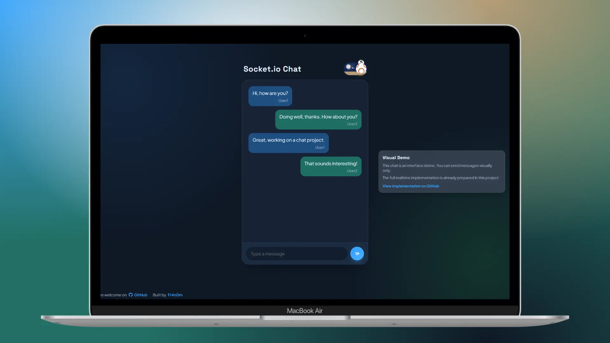
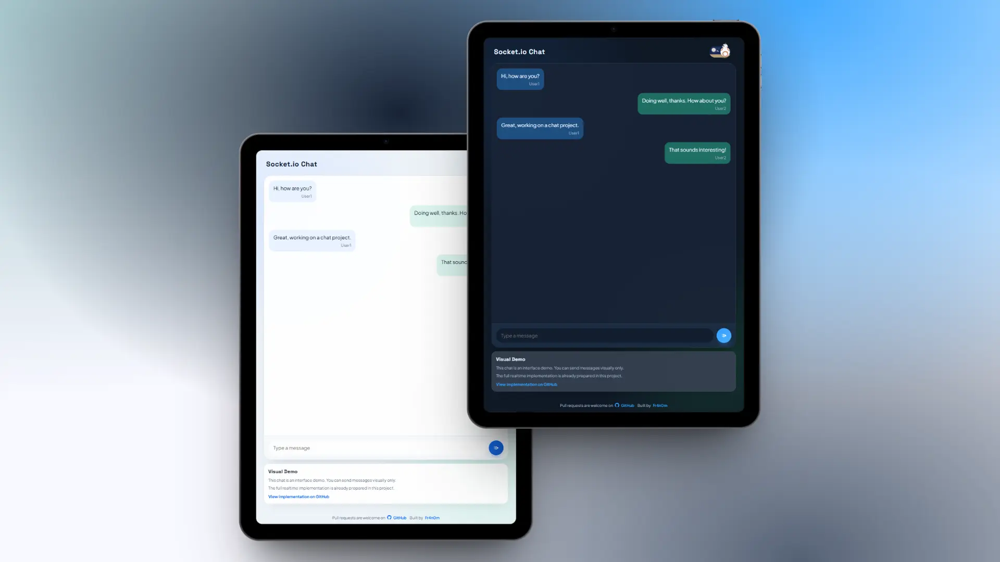

# Realtime Chat





Mock chat UI with production-ready realtime architecture.

## Quick Navigation
- [Readme en Español](#espanol)
- [Readme in English](#english)

---

## Espanol

### 📌 Descripcion
Este proyecto muestra una interfaz de chat con modo demo visual por defecto, mientras mantiene una base backend preparada para una implementacion real.

### ✨ Caracteristicas
- Interfaz de chat moderna con modo claro/oscuro.
- Modo `demo` para mostrar el proyecto sin conexion realtime real en la web publica.
- Modo `live` para activar comportamiento realtime.
- Arquitectura modular en frontend y backend.
- Preparado para usar persistencia en memoria o Supabase.

### 🧱 Arquitectura
#### Frontend
- `main.js`: punto de entrada.
- `client/bootstrap-client.js`: composicion de la app.
- `client/config/*`: configuracion runtime.
- `client/chat/*`: socket + UI de chat.
- `client/demo/*`: comportamiento visual demo.
- `client/theme/*`: cambio de tema.

#### Backend
- `server/index.js`: bootstrap del servidor.
- `server/src/config/*`: lectura/validacion de entorno.
- `server/src/http/*`: middleware y app HTTP.
- `server/src/realtime/*`: eventos Socket.IO.
- `server/src/chat/*`: reglas de dominio (validacion/rate-limit).
- `server/src/storage/*`: adapters de persistencia (`mock` y `supabase`).

### ⚙️ Variables de entorno
Copia `.env.example` a `.env`:

```bash
PORT=4000
CHAT_STORAGE=mock
ALLOWED_ORIGINS=http://localhost:5173,http://localhost:4173,http://localhost:4000
SUPABASE_URL=
SUPABASE_ANON_KEY=
VITE_CHAT_UI_MODE=demo
VITE_GITHUB_URL=https://github.com/Fr4n0m/realtime-chat
VITE_SOCKET_SERVER_URL=
```

Notas:
- Si `CHAT_STORAGE=supabase`, necesitas `SUPABASE_URL` y `SUPABASE_ANON_KEY`.
- `VITE_CHAT_UI_MODE=demo` mantiene la UI en modo visual.
- `VITE_CHAT_UI_MODE=live` activa flujo realtime en frontend.

### 🧪 Scripts
```bash
npm run dev
npm run test
npm run test:watch
npm run build
npm run start
npm run preview
npm run audit
```

### 🤝 Contribuciones
Las contribuciones son bienvenidas.

Si quieres colaborar:
1. Haz fork del repositorio.
2. Crea una rama con tu cambio.
3. Abre una PR con una descripcion clara.

Si ves mejoras en UI, arquitectura o DX, abre una PR: serán muy bien recibidas.

### 📄 Licencia
MIT

---

## English

### 📌 Description
This project provides a chat interface running in visual demo mode by default, while keeping a backend foundation ready for real-world realtime implementation.

### ✨ Features
- Modern chat UI with light/dark mode.
- `demo` mode for showcase behavior without real realtime interaction on public web.
- `live` mode for realtime frontend behavior.
- Modular frontend and backend architecture.
- Memory and Supabase persistence options.

### 🧱 Architecture
#### Frontend
- `main.js`: application entrypoint.
- `client/bootstrap-client.js`: app composition root.
- `client/config/*`: runtime configuration.
- `client/chat/*`: socket + chat UI flow.
- `client/demo/*`: visual demo behavior.
- `client/theme/*`: theme switching.

#### Backend
- `server/index.js`: server bootstrap.
- `server/src/config/*`: environment loading/validation.
- `server/src/http/*`: HTTP app and middleware.
- `server/src/realtime/*`: Socket.IO event wiring.
- `server/src/chat/*`: domain rules (validation/rate-limiting).
- `server/src/storage/*`: persistence adapters (`mock` and `supabase`).

### ⚙️ Environment
Copy `.env.example` to `.env`:

```bash
PORT=4000
CHAT_STORAGE=mock
ALLOWED_ORIGINS=http://localhost:5173,http://localhost:4173,http://localhost:4000
SUPABASE_URL=
SUPABASE_ANON_KEY=
VITE_CHAT_UI_MODE=demo
VITE_GITHUB_URL=https://github.com/Fr4n0m/realtime-chat
VITE_SOCKET_SERVER_URL=
```

Notes:
- If `CHAT_STORAGE=supabase`, `SUPABASE_URL` and `SUPABASE_ANON_KEY` are required.
- `VITE_CHAT_UI_MODE=demo` keeps a visual-only frontend behavior.
- Use `VITE_CHAT_UI_MODE=live` for realtime frontend behavior.

### 🧪 Scripts
```bash
npm run dev
npm run test
npm run test:watch
npm run build
npm run start
npm run preview
npm run audit
```

### 🤝 Contributing
Contributions are welcome.

To contribute:
1. Fork the repository.
2. Create a feature/fix branch.
3. Open a PR with a clear description.

If you spot UI, architecture, or developer experience improvements, feel free to open a PR.

### 📄 License
MIT

---

### 👨‍💻 Portfolio
Built by **Fr4n0m** — https://codebyfran.es
